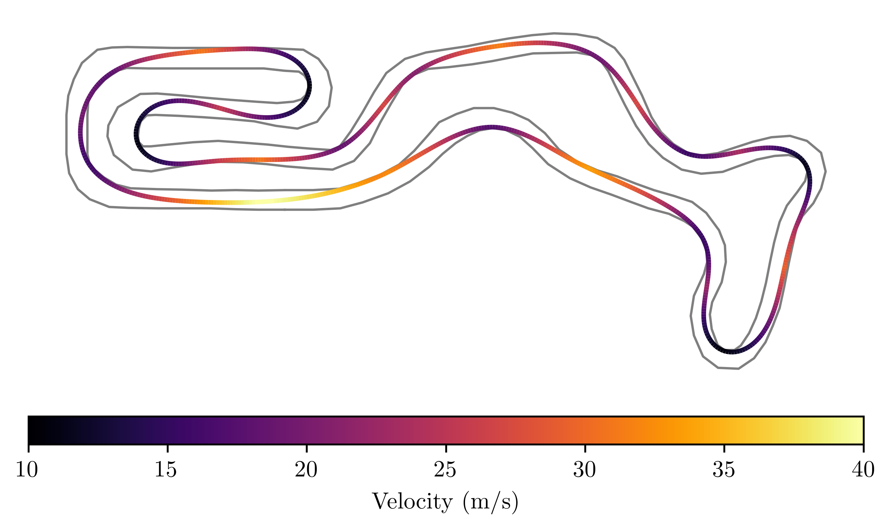
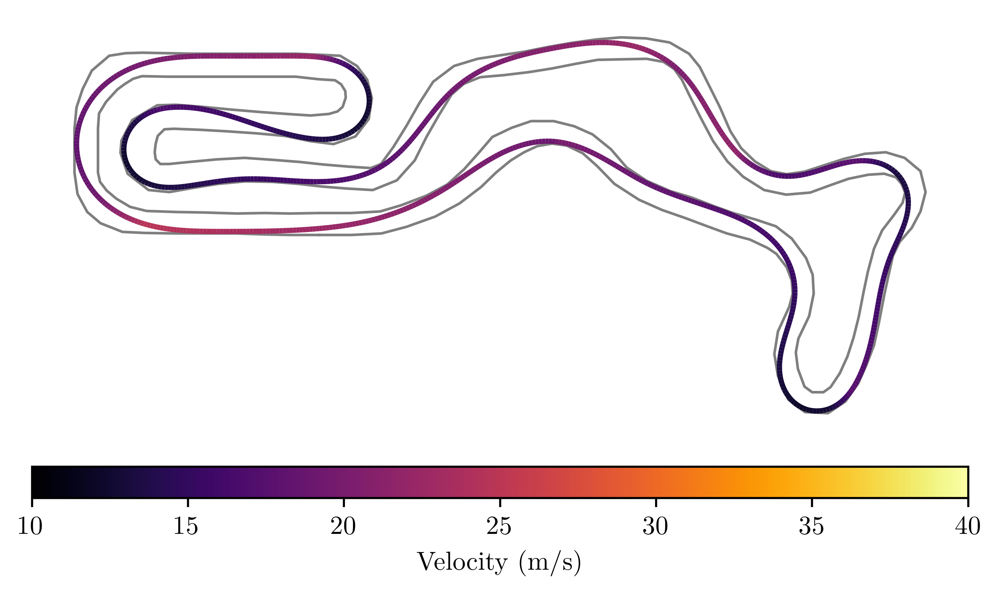
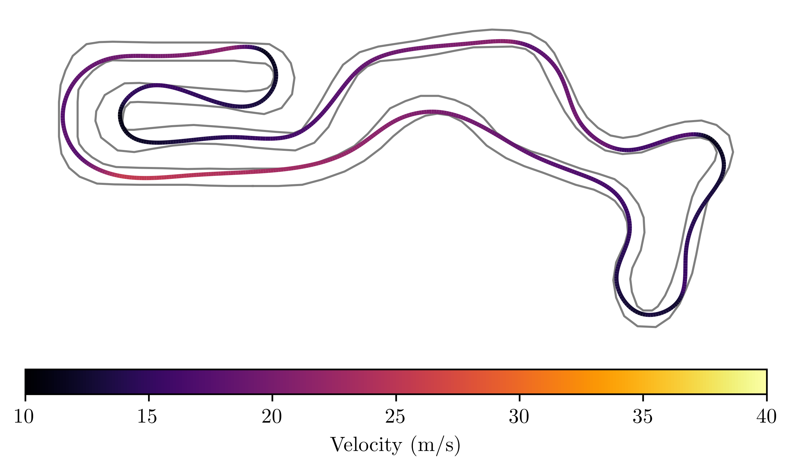
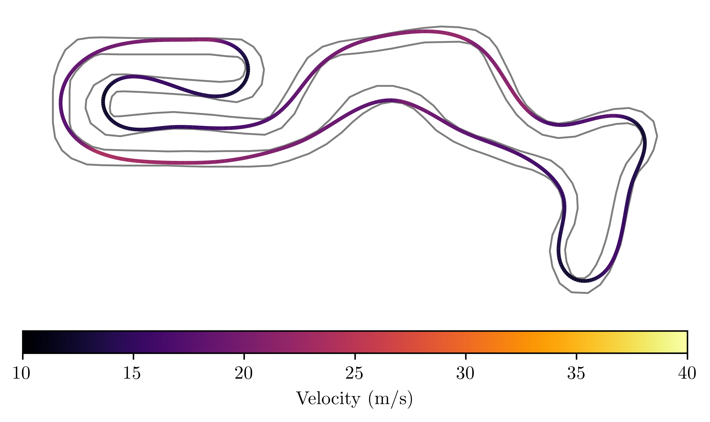

Based on [this repository](https://github.com/joedavison17/dissertation/)

  
  

# Lap time optimisation and mpc control
The project aims to generate optimal trajectories for a car using curvilinear bicycle model, simulate the model's behavior, and compute the control signals required to follow the trajectory. This is achieved using the do_mpc library in python, which is designed for model predictive control (MPC) applications.

## Running the scripts
**Plotting depends on TeX so you may be required to install appropriate packages on your system**

To install the required dependencies in a virutal python environment run:
on Linux:
```bash
python -m venv ./venv
source ./venv/bin/activate
pip install -r ./requirements.txt
```
On NixOS you can use the development shell from this repository instead:
**Only use it on NixOS, this shell overrites $LD_LIBRARY_PATH which may break other systems**
```bash
nix-shell 
```

### Running trajectory optimization
run the `__main__.py` script in `src` directory. You can run the following to get information about script usage:
```bash
python src/__main__.py --help
```
Example usage:
```bash
python src/__main__.py ./data/tracks/buckmore.json ./data/vehicles/tbr18.json  0.8 --nonlinear --plot-all
```
```bash
python src/__main__.py ./data/tracks/buckmore.json ./data/vehicles/tbr18.json 0.8 --bayes --plot-all
```
Parameters:
- Path to a json file representing the track
- Path to the vehicle model parameters (only one model is implemented, Mazda MX5 <3)
- third is a float value, depicting how much track the vehicle can use, where 1 means the whole track, and 0.1 means that only 10% of the track around the center line will be used.
- optimisation method from `--bayes`, `--curvature`, `--compromise`, `--laptime`, `--nonlinear`  (On windows watch out for "\\" and "/")
- plot options: `--plot-path` / `--plot-all`.

### To run the simulation and mpc controller
Examlpe usage:
```bash
python src/mpc.py --laptime
```
Parameters:
- optimisation method from `--bayes`, `--curvature`, `--compromise`, `--laptime`  (On windows watch out for "\\" and "/")
*This describes what optimization was used to generate track trajectory and requires running the said optimization first, to generate required files.*

## Description
The work was divided into three modules. 
### High-level trajectory optimisation
First, a high level trajectory optimisation, takes in a list of points that describe a race track, and according to vehicle model generates an optimal trajectory that minimizing e.g. lap time or curvature. This part is based on code by Joe Davison, which we expanded on by adding two additional methods of optimization: Bayesian and non-linear (COBYLA).

We used a few differrent methods to compare the results between them.
#### Bayesian Optimization
based on an article: [Computing the racing line using Bayesian optimization](https://arxiv.org/pdf/2002.04794).
The method, in brief, is based on generating a trajectory in the form of a one-dimensional list representing the position on the track, calculating the travel time for each position, creating a database from these, and training a Gaussian regressor. The track is represented according to [Racing Line Optimisation for Autonomus Vehicles](documents/dissertation.pdf). Two other representations in the track variable system were also tested, but they did not yield clear results.

#### Non-linear Optimization (COBYLA)
Starts by generating random trajectory, chooses 10 best and using non-linear optimisation , generates an optimal trajectory. It uses **COBYLA algorithm**.
*Recently on some OS, we had some issues with multiprocessing library, where this part of script fails.*

The rest of the methods are described [here](https://github.com/joedavison17/dissertation/). 

#### Models

There are two models used in the project. First was already implemented. Second based on curvilinear bicycle model and Pacejka tire parameters. In order to adjust the latter to the base, there was a need to create additional functions to calculate responding constraints. It was impossible to simply recalculate one model into another. 

<hr />

### Vehicle Model, simulation
We use a curvilinear bicycle model to simulate a car, based on an article: [Optimization-Based Hierarchical Motion Planning for Autonomous Racing](documents/model_description.pdf).
In summary, The model operates in a curvilinear coordinate system relative to a reference path, such as a race track centerline. This model includes dynamic force laws and represents vehicle states like position along the path (arc-length), lateral deviation, and heading angle.
Simplfied Pacejka tire model is used to calculate the lateral tire forces. <br />

<hr />

### Model predictive control
We used **do-mpc library** that implements a mpc controller for this part of the project. The objective function of the optimizer inside do_mpc is also based on an article: [Optimization-Based Hierarchical Motion Planning for Autonomous Racing](documents/model_description.pdf). 
#### Problems with the MPC
We were unable to get good results using the controller, due to error on modelling of the system.
The optimizer takes a really long time to calculate the control signals (a few hours of runtime, for a few seconds of simulation), consuming a lot of RAM (approaching 16GBs)<br />
We think the reason is the way we calculate the curvature of the trajectory symbolically.
##### Problem with calculating curvature of the trajectory
The do_mpc rquirest the model to be writtne using symbolix expressions (using casadi library as a backend). In our project, we utilize B-splines to define the trajectory that our vehicle will follow, with these splines parameterized by a variable `u`. To effectively plan and control the vehicle's path, we need a symbolic expression for the curvature at a given arc-length `s`. <br />
However, directly obtaining this symbolic expression is challenging because there is no straightforward translation between the parameter `u` and arc-length `s`. <br />
As a solution, we sample the curvature at a given arc-length s, and generate a look-up table, from which we generate a symbolic expression using linear piecewise approximation.
Resulting expression, due to being a complex, long piecewise expression, and by nature not a smooth function, maybe be bad for optimization algorithms.

### Results

#### Results for trajectory optimization of Buckmore track, tbr18 model
|Method:       |   curvature   | Compromise | Lap Time | Bayesian Optimisation |  non-linear optimisation |
| ----------- |:-------------:|:----------:|:----------:|:-------------:|:----------------------:|
|Lap time      |     39.934    |   37.810  |   40.892    |     36.227    |           36.178      |
|Run time      |     2.037     |   35.233  |   47.472    |     22.396    |           106.063     |
|Path Length   |     860.772   |   790.462 |   830.327   |     773.561   |           772.140     |
|Max velocity  |     40.050    |   40.833  |   37.790    |     41.365    |           43.333      |
|Mean velocity |     23.414    |   22.958  |   22.293    |     23.908    |           23.833      |

#### Results for trajectory optimization of Buckmore track, Mazda MX5 model
|Method:       |   curvature   | Compromise | Lap Time | Bayesian Optimisation |
| ----------- |:-------------:|:----------:|:----------:|:-------------:|
|Lap time      |     49.172    |   47.730  |   53.648    |     48.056    |
|Run time      |     5.301     |   101.786  |   65.495    |     27.840    |
|Path Length   |    856.095    |   810.150 |   845.530   |     806.397   |
|Max velocity  |     24.783    |   23.753  |   24.186    |     25.615    |
|Mean velocity |     18.000    |   17.525  |   16.323    |     17.506    |


#### Curvature (tbr18 model)

#### Compromise (tbr18 model)

#### Lap Time (tbr18 model)

#### Bayesian (tbr18 model)

<!-- ### Non-linear
 -->

#### Curvature (Mazda MX5)

#### Bayesian (Mazda MX5)

#### Compromise (Mazda MX5)

#### Lap-time (Mazda MX5)


TODO wykresy z Symulacji, mpc


