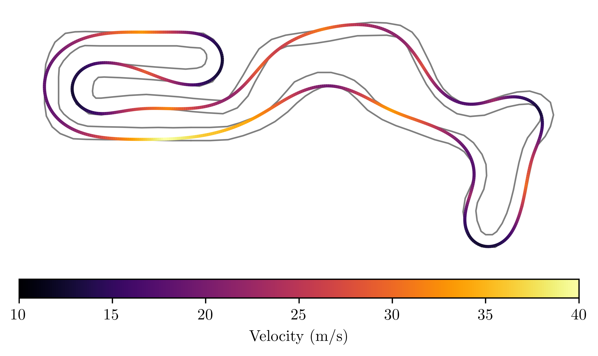
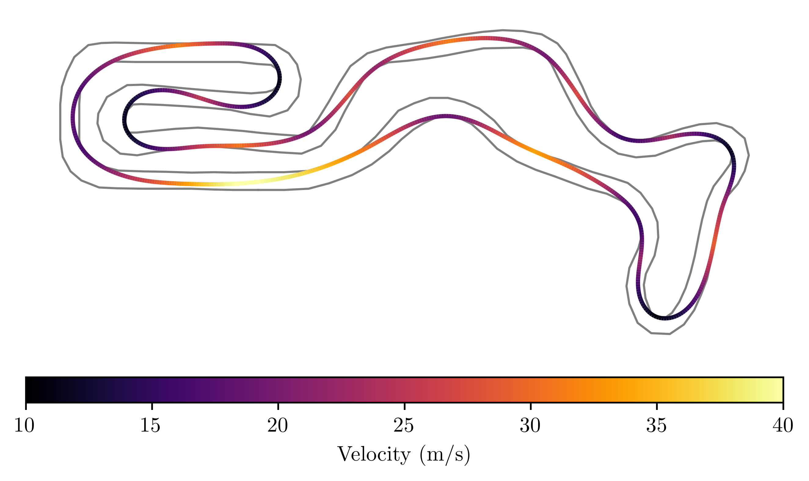
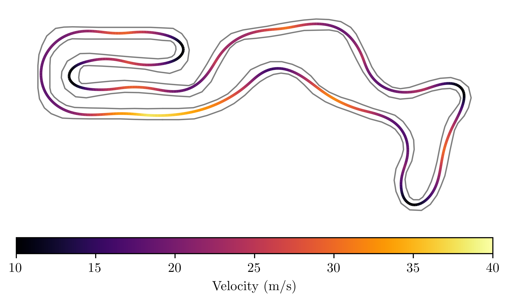
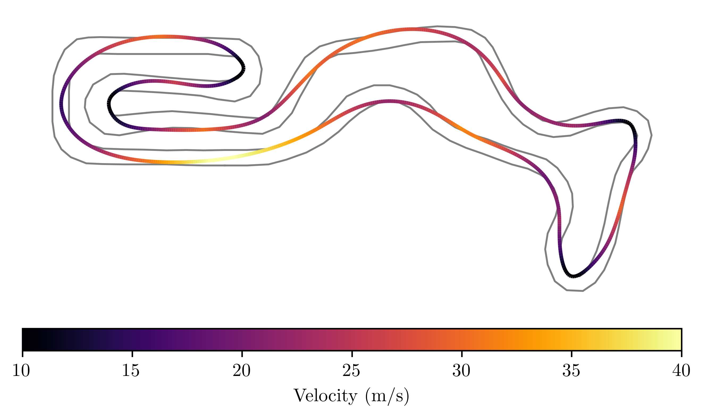

Based on [this repository](https://github.com/joedavison17/dissertation/)
# lap-time-optimization

## Running the scripts
To install the required dependencies run:
```bash
python3 -m venv ./venv
source ./venv/bin/activate
pip install -r ./requirements.txt
```

Plotting depends on TeX so you may be required to install appropriate packages on your system

On NixOS you can use the development shell from this repository instead:
```bash
nix-shell # !!! Only use it on NixOS, this shell overrites $LD_LIBRARY_PATH which may break other systems
```

### To run the optimisation:
run the `__main__.py` script in `src` directory. You can run the following to get information about script usage:
```bash
python src/__main__.py --help
```
Example usage:
```bash
python3 src/__main__.py ./data/tracks/buckmore.json ./data/vehicles/tbr18.json  0.8 --nonlinear --plot-all
```
```bash
python3 src/__main__.py ./data/tracks/buckmore.json ./data/vehicles/tbr18.json 0.8 --bayes --plot-all
```
First argument chooses track, second vehicle (two models implemented, tbr18 and MX5), third is a float value, depicting how much track 
wehicle can use, where 1 means whole track to the boundries from left and right, and 0 means only narrow mid part of track. Next choose optimisation method from {--bayes, --curvature, --compromise, --laptime} and what to plot. 

### To run the controller:
```bash
python3 src/mpc.py
```

*\[PL\]*
## Założenia

Założeniem projektu było po pierwsze wykonanie algorytmów optymalizujących prędkość przejazdu modelu po torze i porównanie ich wyników, t.j.
prędkości maksymalnej, prędkości średniej, długości znalezionej ścieżki oraz czasu przejazdu. Drugą częścią projektu stanowiło zaimplementowanie nowego modelu, zgodnego z /documents/model_description.pdf, a następnie użycie biblioteki do_mpc do śledzenia wcześniej wyliczonej trajektorii i wyznaczenie sterowania dla nowego modelu. Wykorzystano kod stworzony przez 
Joe Davison'a, jako bazę. Dzięki temu zostały już zaimplementowane metody obliczania czasu, plotowania wyników etc.  

## Realizacja
### Algorytmy optymalizacji
Niestety przez brak czasu i napotkane problemy podczas implementacji (które znacznie utrudniły wykonanie projektu)
udało się zaimplementować tylko dwa algorytmy.
1. Pierwszy jest oparty na dokumentacji https://arxiv.org/pdf/2002.04794. 
Jest to Bayesian optimisation. 
Metoda ta w dużym skrócie oparta jest na wylosowaniu trajektorii w postaci jednowymiarowej listy reprezentującej pozycję na torze, 
policzeniu dla każdej z nich czasu przejazdu, stworzeniu z nich bazy danych i
wyuczeniu regrosora Gaussowskiego. Tor reprezentowany jest zgodnie z */documents/dissertation.pdf*. 
Wypróbowano jeszcze dwie reprezantacje w ukladzie zmiennych toru, jednak nie dawały jednoznacznych rezultatów. 

2. Drugi to non-linear optimisation, dokonuje wylosowania ścieżek na trasie, wybiera 10 najlepszych i dokonuje na nich optymalizaci nieliniowej, 
za pomocą algorytmu *COBYLA*. (na ten moment proszę nie uruchamiać, pojawił się niespodziewany błąd uniemożliwiający dokończenie liczenia w tej metodzie)

#### Wyniki dla toru buckmore i modelu tbr18
Wyniki przedstawiono w tabeli: 
|Method:       |   curvature   | Compromise | Lap Time | Bayesian Optimisation |  non-linear optimisation |
| ----------- |:-------------:|:----------:|:----------:|:-------------:|:----------------------:|
|Lap time      |     39.934    |   37.810  |   40.892    |     36.227    |           36.178      |
|Run time      |     2.037     |   35.233  |   47.472    |     22.396    |           106.063     |
|Path Length   |     860.772   |   790.462 |   830.327   |     773.561   |           772.140     |
|Max velocity  |     40.050    |   40.833  |   37.790    |     41.365    |           43.333      |
|Mean velocity |     23.414    |   22.958  |   22.293    |     23.908    |           23.833      |

Na końcu upisu przedstawiono także wykresy trajektorii, w celu wizualizacji. 

#### Wyniki dla toru buckmore i modelu MX5
<!-- TODO --> tabelka

### Model i kontroler

1. Zaimplementowano nowy model. Niestety różnice pomiędzy wcześniej już istniejącym okazały się bardzo duże. Nie można było jednoznacznie przeliczyć wartości z jednego na drugiego. Do dostosowania do projektu zastosowano metody wyliczające ograniczenia. 

2. Wyznaczono optymalną trajektorię przy pomocy jednej z metod.

<!-- TODO --> jakie jeszcze ograniczenia?
3. Wyliczono ograniczenia na elipsę trakcji, ... . Zgodne z równaniami w dokumencie documents/model_description.pdf

4. Dodano wszystkie wartości do modelu w bibliotece do_mpc.py, wyliczono obiekty reprezentujące. 

<!-- TODO --> czemu wyniki są niezadowalające?
5. Policzono sterowanie dla stanów na torze. Niestety wyniki są niezadowalające

6. Stworzono symulację w celu wizualizacji sterowania i położenia pojazdu względem toru. 

#### Wyniki:

<!-- TODO --> przedstawić wyniki z MPC.


## Wykresy:
### Curvature

### Compromise

### Lap Time

### Bayesian

### Non-linear


